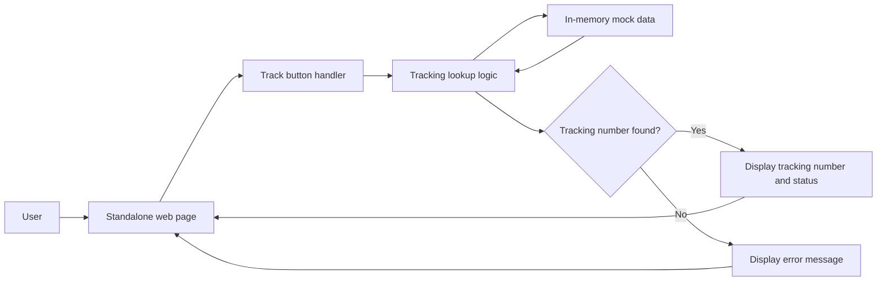

# Package Delivery Tracker Architecture

## 1. Architecture Overview

The tracker is a standalone, client-side web page. It uses a small in-memory collection of mock tracking records and performs lookups when the user clicks **Track**. No server, database, external API, framework, or dependency is required.

## 2. Key Components and Responsibilities

### User Interface

- Provides a tracking-number input.
- Provides the **Track** button.
- Displays the entered tracking number and current delivery status for a match.
- Displays an error message when no mock record matches.

### Mock Data Store

- Holds the four required tracking numbers and their statuses:
  - `TRK-1001` - Order Received
  - `TRK-1002` - In Transit
  - `TRK-1003` - Out for Delivery
  - `TRK-1004` - Delivered

### Tracking Lookup Logic

- Runs when the user clicks **Track**.
- Reads the tracking number from the input.
- Looks it up in the mock data store.
- Sends either the matching data or a not-found result to the UI.

### Result and Error Display

- Shows both the tracking number and delivery status when a match is found.
- Shows an error message when the tracking number is not found.

## 3. Technology Choices and Justification

- **HTML:** Defines the standalone page, input, button, and result areas.
- **CSS:** Provides the page presentation without a UI framework.
- **Vanilla JavaScript:** Handles the button click, mock-data lookup, and conditional result/error display with no unnecessary dependency.
- **In-memory JavaScript object:** Provides the required sample/mock data without a backend or database.

These choices directly support the small scope and standalone-page requirement while keeping the tracker easy to run by opening the HTML file in a browser.

## 4. Data Flow

1. The user enters a tracking number.
2. The user clicks **Track**.
3. The tracking lookup logic reads and normalizes the input.
4. The logic checks the mock data store for the tracking number.
5. If found, the UI displays the tracking number and its current delivery status.
6. If not found, the UI displays an error message.

## 5. Component Diagram

